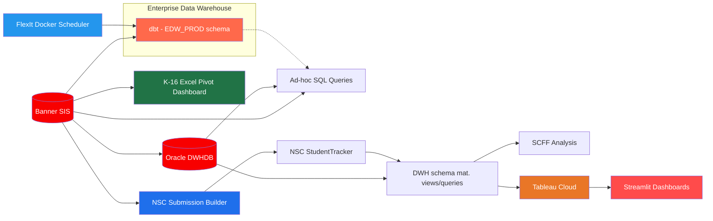

# NOCCCD Data Team

Data infrastructure and analytics for **North Orange County Community College District** — managed by [NOCCCD District](https://www.nocccd.edu/) and serving [Cypress College](https://www.cypresscollege.edu/), [Fullerton College](https://www.fullcoll.edu/), and [North Orange Continuing Education (NOCE)](https://noce.edu/).

## Repositories

| Repo | Description | Stack |
|------|-------------|-------|
| [**nocccd-edw**](https://github.com/nocccd-data/nocccd-edw) | Enterprise Data Warehouse built with dbt on Oracle — staging, intermediate, and mart layers (dims + facts) |    |
| [**nocccd-scff**](https://github.com/nocccd-data/nocccd-scff) | Student Centered Funding Formula data loading, crosswalks, and analysis for district use |    |
| [**nocccd-k16**](https://github.com/nocccd-data/nocccd-k16) | K-16 grant reporting automation — queries Oracle Banner (REPT) and builds a headless Excel pivot dashboard from scratch (no template, no Excel app) |     |
| [**nocccd-nsc**](https://github.com/nocccd-data/nocccd-nsc) | National Student Clearinghouse (NSC) StudentTracker submission builder and return-file loader into the DWH warehouse schema |    |
| [**nocccd-sql**](https://github.com/nocccd-data/nocccd-sql) | Ad-hoc SQL queries organized by campus (Cypress, Fullerton, NOCE, District) |   |
| [**nocccd-streamlit**](https://github.com/nocccd-data/nocccd-streamlit) | Ad-hoc reporting dashboards for district use (Oracle / Tableau Cloud) |    |
| [**nocccd-flexit-docker-deploy**](https://github.com/nocccd-data/nocccd-flexit-docker-deploy) | Docker deployment for daily production dbt build refreshes and scheduling, wrapped in the FlexIt web deployment kit |    |

## Architecture

## Tech Stack

- **Data Warehouse**: dbt + Oracle — source staging, transformations, dimensional models (dims & facts)
- **Dashboards**: Streamlit with Oracle and Tableau Cloud connectors
- **Analysis**: Python, Pandas, SQL
- **Reporting pipelines**: Python + Oracle — K-16 grant Excel dashboards (excelize, headless pivots) and NSC StudentTracker submission/return processing
- **Scheduling**: FlexIt Docker — daily production dbt refresh orchestration
- **Source System**: Ellucian Banner (Student Information System)